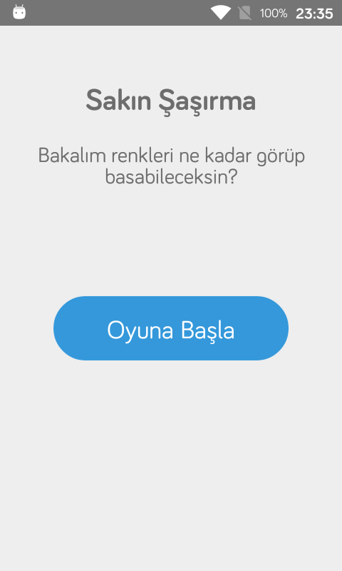
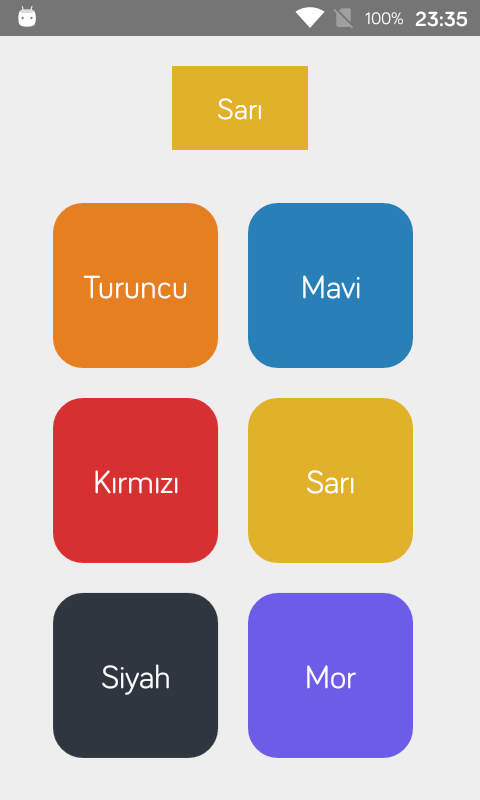
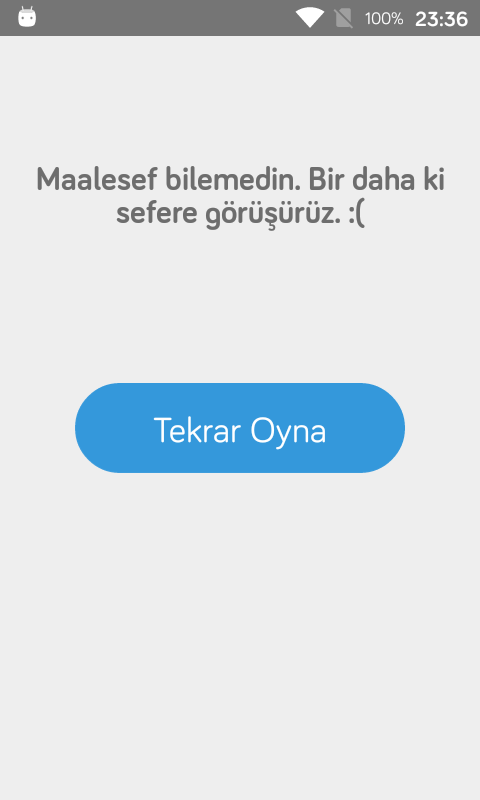

# Sakın Şaşırma Oyunu Nedir?

React native ile yazılmış bir mobil oyundur. Oyunu asıl yazma sebebim, React Hooks, Context Api ve Navigation olayını yapmaktı. Oyunun amacı üst kısımda söylenilen rengi altındaki renklere bakarak bilmek. Kolay gibi görünse de, ileriki seviyelerde doğru rengi bulmak hiç kolay olmayacak.

  

## Nasıl kurulur?

```sh

$ git clone https://github.com/Phoique/sakin-sasirma.git

$ cd sakin-sasirma

$ yarn install & npm install

$ react-native run-android & react-native run-ios

```

## Neler eksik, bir sonraki sürüm hakkında?

Oyunu sadece eski android cihazımda test edip yaptığım için ne ios ne de diğer android telefonlar üzerinde test yapamadım. O yüzden kendi cihazımda tasarım neden böyle demeyin. :)

  

### Bir sonraki sürümde yapılması gerekenler:

- Diğer Android ve İos cihazlarında tasarımın test edilmesi.

- Tasarımın biraz daha oyun olduğuna dair değişiklikler.

- Skor olayının gelmesi.

- Seviye olayının gelmesi.

- Oyunda rengi doğru bildiğinde renklerin değişmesi (reflesh).

- Fazladan renklerin yazdırılmasının engellenmesi (eğer böyle bir sorun varsa?).

- Tekrar eden kod optimizasyonu.

- Tekrar eden styles kodları optimizasyonu.

- Unit test yazılması.

  

## Nasıl görünüyor?(Eski Android cihazımda)



